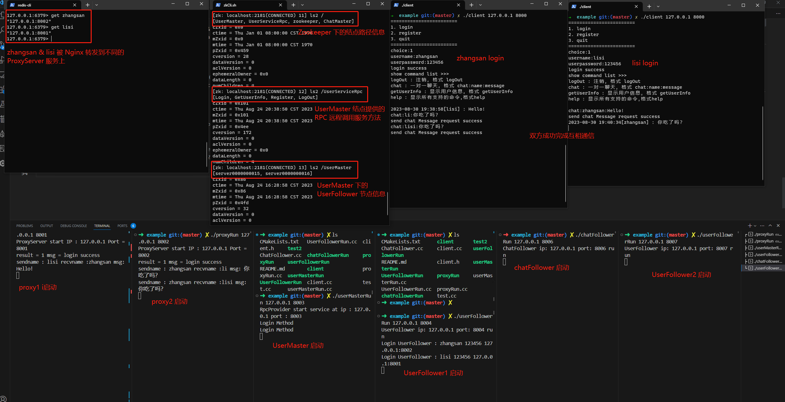

# ChatRoom 基于分布式的集群聊天室

## 项目介绍
该项目主要是针对自己今年在 5,6 份找实习的时候，被面试官问到[之前的单机聊天室项目](https://github.com/Fightjiang/SocketProject/tree/master/Epoll_Chat)是否考虑分布式应用所做的提升和优化，最终完成的基于分布式的集群聊天室，客户端所有的请求首先打到 Proxy 服务器上，由 Proxy 服务器根据请求的功能转发到不同的集群上，集群采用主从设计思路，主要有：用户管理集群（负责用户的登录注册注销）、聊天消息转发集群(转发在线或离线消息)


## 项目主要技术点
* 基于 Nginx 将客户端请求转发到不同的 Proxy 服务器上来达到负载均衡能力
* 基于 Muduo 网络库开发以实现高性能 IO 事件处理，并解耦业务模块和网络模块之间的代码逻辑
* 基于 Protobuf 实现 RPC 方法调用参数的(反)序列化，并编写轻量级 RPC 服务框架使用
* 基于 Zookeeper 分布式协调服务中间件提供集群服务配置信息的统一管理
* 基于 Redis 实现分布式锁和用户登陆信息状态的保存
* 基于 Mysql 保存集群聊天室的用户数据

## ChatRoom 架构图


ChatRoom 项目的大致架构图，从数据流的角度可以这样分析：

1. 客户端请求 Nginx 的服务应用端口，在 Nginx 配置实现负载均衡可以分别将流量转发到 Proxy 集群服务统一处理请求。
2. Proxy 服务器负责解析客户端请求并调用对应的 RPC 方法，也就是把请求转发到对应提供 RPC 方法的业务集群。
3. 每个业务集群采用主从模式，主节点按照轮询的方式把请求转发到子节点上进行请求响应；我们把每个业务集群分别划分负责了不同的功能模块，主要有：用户管理集群(负责用户的登录、注销、注册)；聊天消息转发集群(在线 or 离线消息)
4. 最后每个从服务器将请求响应结果返回给主服务器，主服务器将结果返回给 Proxy 服务器，Proxy 服务器将结果转发给客户端。

## 用户管理集群

我们对外提供一个主节点 UserMaster ，所有关于登录、注册、注销的业务需求都交由 UserMaster 转发给 UserFollower 处理，从而实现集群的负载均衡能力。UserFollower 是真正负责处理请求响应的节点，它负责与 Redis、Mysql 进行交互，并且将自己的服务器信息注册到 Zookeeper 上以便供 UserMaster 获取和转发请求。

* **主节点：UserMaster** : 所有关于 登录、注册、注销、获取用户信息的业务请求都会在这里得到中转，按照轮询的方式每次都选取一个可用的 UserFollower 节点处理请求，然后接收 UserFollower 的请求转发回去。

* **从节点：UserFollower** : UserFollower 是整个服务集群中真正提供请求响应处理的节点，并通过从数据库连接池中获得 Mysql 连接将请求持久化到数据库中。

[用户管理集群详解](./src//user/README.md)

## 消息转发集群


ChatFollower 节点信息供 Proxy 主节点管理，主要考虑到客户端是与 Proxy 建立连接的，最终的消息转发到客户端都要通过 Proxy，故 ChatFollower 可以直接与 Proxy 建立连接转发消息。ChatFollower 会先去 Redis 服务器上查询这个用户是否在线；如果在线，取得与它建立连接的 Proxy 服务器信息(IP:Port)，并发送请求给 Proxy 要求转发消息给客户端。如果不在线则将消息转存到 Mysql 的 offlinemessage 表中，供该用户上线时读取。

[消息转发集群](./src/chat/README.md)


## Proxy 节点转发请求方法主要函数
ProxyServer 在接收到消息之后，需要反序列化获得 request Method 找到对应的处理函数
```
//读写事件回调函数
void ProxyServer::on_message(const muduo::net::TcpConnectionPtr &conn, muduo::net::Buffer *buffer, muduo::Timestamp stamp)
{
    //反序列化
    std::string recv_str = buffer->retrieveAllAsString();
    Proxy::ProxyRequest request;
    request.ParseFromString(recv_str);

    //获取对应的处理器并执行
    auto msg_handler = proxyService_->getHandler(request.type());
    std::string strMsg = request.request_msg();
    msg_handler(conn, strMsg, stamp);
}

//获得请求对应的转发处理函数
ProxyService::MsgHandler ProxyService::getHandler(std::string msg_type)
{
    //记录错误日志，msgid没有对应的事件处理回调
    auto it = msg_handler_map_.find(msg_type);
    //如果没有对应的msgid
    if (it == msg_handler_map_.end())
    {
        return [=](const muduo::net::TcpConnectionPtr &conn, std::string &recv_buf, muduo::Timestamp time) {};
    }
    else
    {
        return msg_handler_map_[msg_type];
    }
}

// msg_handler_map 保存的方法
msg_handler_map_.insert({"Login", std::bind(&ProxyService::login, this, std::placeholders::_1, std::placeholders::_2, std::placeholders::_3)});
msg_handler_map_.insert({"Register", std::bind(&ProxyService::regist, this, std::placeholders::_1, std::placeholders::_2, std::placeholders::_3)});
msg_handler_map_.insert({"Logout", std::bind(&ProxyService::logout, this, std::placeholders::_1, std::placeholders::_2, std::placeholders::_3)});
msg_handler_map_.insert({"getUserInfo", std::bind(&ProxyService::getUserInfo, this, std::placeholders::_1, std::placeholders::_2, std::placeholders::_3)});
msg_handler_map_.insert({"chatMessage", std::bind(&ProxyService::chatMessage, this, std::placeholders::_1, std::placeholders::_2, std::placeholders::_3)});
msg_handler_map_.insert({"forwardMessage", std::bind(&ProxyService::forwardMessage, this, std::placeholders::_1, std::placeholders::_2, std::placeholders::_3)});
```

## 项目环境
* Ubuntu18.04、VScode、g++、C++11、Cmake
* 需要安装的库：Nginx 、muduo 、Redis 、Mysql 、Zookeeper 、Protobuf

## 项目运行示例


## 项目缺陷 & 待完善

1. 系统的容灾考虑不够，UserMaster 挂了则影响整个服务。比如按照目前的架构，UserMaster 会存在很大的网络压力，因为所有的 ProxyServer 转发的用户请求方法都是集中到 UserMaster 统一处理，然后转发到 UserFollower 上处理，这样是不合理的。后续应该改成像 ChatFollower 与 ProxyServer 建立的连接一样，把自己的节点信息注册到 Zookeeper 上的临时节点上，再采用轮询选择的方法与 UserMaster 建立连接转发请求。

2. 目前 UserMaster 选则 UserFollower 采用的方法是简单的轮询方法。但是这个方法存在缺陷，如一个新上线的节点，本来应该承担更多的请求，但是这个时候还是轮询，就没有发挥出新节点应该有的能力，故后续可以改成在 Node 里面计每个 Follower 接收的次数，有侧重的转发请求。

3. 业务上需要有加上分布式锁，但是目前的实现比较简单，是采用轮询的方式去判断是否加锁成功，可以改成消息订阅通知的形式。包括当 Zookeeper 上的结点信息发生变化的时候，目前也只是在主服务主动判断所有结点信息是否发生了变化，也可以添加通知订阅结点的方式。 

4. 业务功能扩展，如：添加创建群聊功能等。

## 项目模块讲解

* [Nginx 简单配置](./nginxConfig.md)
* [数据库连接池]()
* [Muduo 网络库介绍]()
* [Protobuf 基础讲解]()
* [Zookeeper 基础讲解]()
* [RPC 框架建立]()


## 参考代码库
1. [Cluster-Chat-Server](https://github.com/Shangyizhou/Cluster-Chat-Server/tree/main)
2. [Chat-Server](https://github.com/shenmingik/Server)
3. [ByteTalk](https://github.com/shenmingik/ByteTalk)
