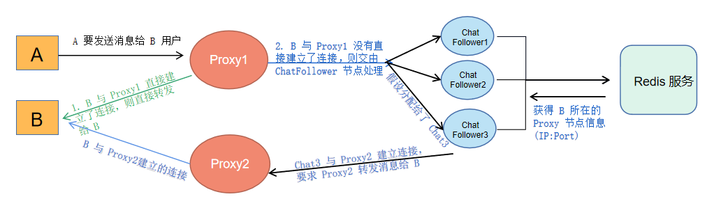

# ChatRoom 基于分布式的集群聊天室

## 项目介绍
该项目主要是针对自己今年在 5,6 份找实习的时候，被面试官问到[之前的单机聊天室项目](https://github.com/Fightjiang/SocketProject/tree/master/Epoll_Chat)是否考虑分布式应用所做的提升和优化，最终完成的基于分布式的集群聊天室，客户端所有的请求首先打到 Proxy 服务器上，由 Proxy 服务器根据请求的功能转发到不同的集群上，集群采用主从设计思路，主要有：用户管理集群（负责用户的登录注册注销）、聊天消息转发集群(转发在线或离线消息)

## 项目主要技术点
* 基于 Nginx 将客户端请求转发到不同的 Proxy 服务器上来达到负载均衡能力
* 基于 Muduo 网络库开发以实现高性能 IO 事件处理，并解耦业务模块和网络模块之间的代码逻辑
* 基于 Protobuf 实现 RPC 方法调用参数的(反)序列化，并编写轻量级 RPC 服务框架使用
* 基于 Zookeeper 分布式协调服务中间件提供集群服务配置信息的统一管理
* 基于 Redis 实现分布式锁和用户登陆信息状态的保存
* 基于 Mysql 保存集群聊天室的用户数据

## ChatRoom 架构图

ChatRoom 项目的大致架构图，从数据流的角度可以这样分析：

1. 客户端请求 Nginx 的服务应用端口，在 Nginx 配置实现负载均衡可以分别将流量转发到 Proxy 集群服务统一处理请求。
2. Proxy 服务器负责解析客户端请求并调用对应的 RPC 方法，也就是把请求转发到对应提供 RPC 方法的业务集群。
3. 每个业务集群采用主从模式，主节点按照轮询的方式把请求转发到子节点上进行请求响应；我们把每个业务集群分别划分负责了不同的功能模块，主要有：用户管理集群(负责用户的登录、注销、注册)；聊天消息转发集群(在线 or 离线消息)
4. 最后每个从服务器将请求响应结果返回给主服务器，主服务器将结果返回给 Proxy 服务器，Proxy 服务器将结果转发给客户端。

## 用户管理集群

我们对外提供一个主节点 UserMaster ，所有关于登录、注册、注销的业务需求都交由 UserMaster 转发给 UserFollower 处理，从而实现集群的负载均衡能力。UserFollower 是真正负责处理请求响应的节点，它负责与 Redis、Mysql 进行交互，并且将自己的服务器信息注册到 Zookeeper 上以便供 UserMaster 获取和转发请求。

* **主节点：UserMaster** : 所有关于 登录、注册、注销、获取用户信息的业务请求都会在这里得到中转，按照轮询的方式每次都选取一个可用的 UserFollower 节点处理请求，然后接收 UserFollower 的请求转发回去。

* **从节点：UserFollower** : UserFollower 是整个服务集群中真正提供请求响应处理的节点，并通过从数据库连接池中获得 Mysql 连接将请求持久化到数据库中。

[用户管理集群详解](./src//user/README.md)

## 消息转发集群

ChatFollower 节点信息供 Proxy 主节点管理，主要考虑到客户端是与 Proxy 建立连接的，最终的消息转发到客户端都要通过 Proxy，故 ChatFollower 可以直接与 Proxy 建立连接转发消息。ChatFollower 会先去 Redis 服务器上查询这个用户是否在线；如果在线，取得与它建立连接的 Proxy 服务器信息(IP:Port)，并发送请求给 Proxy 要求转发消息给客户端。如果不在线则将消息转存到 Mysql 的 offlinemessage 表中，供该用户上线时读取。

[消息转发集群](./src/chat/README.md)

## Zookeeper 

Zookeeper 主要具有的功能有：1. 数据发布/订阅; 2. 集群管理(选举); 3. 分布式管理(分布式锁、数据同步及一致性)。 Leader 选举规则： 1. Epoch 大的直接胜出； 2. Epoch 相同，事务 id 大的胜出； 3. 事务 id 相同，服务器 id 大的胜出

主服务器 Master 负责从 Zookeeper 对应的路径下查找到从节点 Follower 的 IP:Port 然后进行数据转发。从服务器一旦启动就会往 Zookeeper 中的对应路径下写入自己的 IP:Port 注册临时节点，这样一旦服务器断开连接，临时节点上的数据就会被删除。

Zookeeper 在这里其实主要就是起到一个配置中心的目的，Zookeeper 上面我们标识了每个类的方法所对应的分布式节点地址，当我们其他服务器想要发起 RPC 调用的时候，就先去 Zookeeper 上查询对应要调用的服务在那个节点上。
