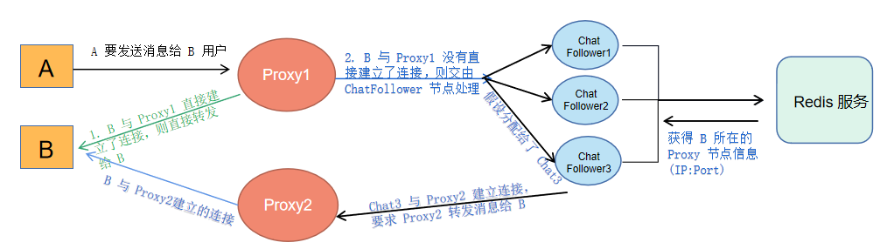

## Chat 集群的设计



客户端都是与 ProxyServer 建立连接，所以如果转发的消息就在这台服务器上，那么则直接转发给客户端即可，如果没在这台服务器上则需要通过 chatServer 集群帮忙转发消息。 ChatServer 是 ProxyService 的从服务器，专门负责转发消息，有以下几种情况

1. 如果用户需要发送给对方的 ClientFd 与 ProxyService 直接相连，那么可以直接转发消息给客户端，不用再经过 ChatServer 集群。

2. 如果没有直接相连，那么需要借助 ChatServer 集群服务器帮助转发消息，ChatServer 收到 ProxyService 发送过来的请求之后开始判断
    * 用户下线，则直接把发送的消息存入用户的离线消息表中。
    * 用户在线，则从 Redis 中拿到用户对应的建立连接的 ProxyService 服务器所在的 IP:Port ，并建立连接并将消息转发给该 Proxy 服务器，然后该 Proxy 服务器会转发给客户端

### Proxy 处理客户发送消息的请求 , 判断是否直接相连
```C++
// 收到客户端发送给其他用户的聊天消息
void ProxyService::chatMessage(const muduo::net::TcpConnectionPtr &conn, std::string &recv_buf, muduo::Timestamp time)
{
    // 反序列化
    ChatMessage::Message request;
    request.ParseFromString(recv_buf);

    std::string recvName = request.recvname() ; 
    auto it = use_connection_map_.find(recvName);

    std::cout <<"sendname : "<< request.sendname() << " recvname :" << request.recvname() 
              << " msg: " << request.msg() << std::endl ;

    // 不在此服务器上
    if (it == use_connection_map_.end())
    {
        // 获取一个与转发服务器交互的可以连接
        std::shared_ptr<Socket> client_fd;
        while ((client_fd = master_.GetFollowerFd()) == nullptr)
        {
            sleep(1);
        }
        // 发给 chatFollower 节点服务器做消息转发
        // chatFollower 通过查找 Redis 查看 recvName 用户在那台 Proxy 节点登录
        // 再与 Proxy 节点建立联系，发送转发消息给 Proxy 节点转发给客户端

        ChatMessage::ChatRequest chatRequest ;
        chatRequest.set_type("ChatMessage") ;
        chatRequest.set_message(recv_buf) ;
        std::string sendStr = chatRequest.SerializeAsString() ; 
        if(send(client_fd->fd(), sendStr.data(), sendStr.size(), 0) == -1) {
            ChatMessage::ChatResponse chatResponse ; 
            chatResponse.set_is_success(false) ; 
            chatResponse.set_message("send chat Message request error") ; 
            
            //序列化并发送
            Proxy::ProxyResponse ProxyResponse;
            ProxyResponse.set_type("SendChatMessage") ;
            ProxyResponse.set_response_msg(chatResponse.SerializeAsString()) ;
            
            std::string send_str = ProxyResponse.SerializeAsString();
            conn->send(send_str); 
             
            return ; 
        }
    }
    else// 客户端与该 Proxy 服务器直接相连着的，则直接转发消息给该用户
    {
        //序列化并发送
        Proxy::ProxyResponse ProxyResponse;
        ProxyResponse.set_type("RecvChatMessage") ;
        ProxyResponse.set_response_msg(recv_buf) ;
        std::string send_str = ProxyResponse.SerializeAsString();
        it->second->send(send_str);
    }
    
    ChatMessage::ChatResponse chatResponse ;  
    chatResponse.set_is_success(true) ; 
    chatResponse.set_message("send chat Message request success") ; 
    
    Proxy::ProxyResponse ProxyResponse;
    ProxyResponse.set_type("SendChatMessage") ;
    ProxyResponse.set_response_msg(chatResponse.SerializeAsString()) ;

    //序列化并发送
    std::string send_str = ProxyResponse.SerializeAsString();
    conn->send(send_str);  
}
```
### Proxy 从 ChatServer 接收到要求转发给客户端
```C++
// 收到 ChatFollower 发送过来的转发消息给客户端的请求
void ProxyService::forwardMessage(const muduo::net::TcpConnectionPtr &conn, std::string &recv_buf, muduo::Timestamp time)
{
    //反序列化
    ChatMessage::Message request;
    request.ParseFromString(recv_buf);
    
    // 转发消息给用户 response.set_type 用于给用户区分类型
    Proxy::ProxyResponse response;
    response.set_type("RecvChatMessage");
    response.set_response_msg(recv_buf);

    std::string recvName  = request.recvname();
    muduo::net::TcpConnectionPtr client_conn = nullptr ;
    {
        std::lock_guard<std::mutex> lock(mutex_);
        auto it = use_connection_map_.find(recvName);
        client_conn = it->second;
    }

    if (client_conn != nullptr) {
        client_conn->send(response.SerializeAsString());
    } else { // 处理转发的时候用户下线这种异常的情况， send 失败则让 chatFollower 继续写入离线消息表中 
        std::cout << "user already LogOut" << std::endl ; 
        // 获取一个与转发服务器交互的可以连接
        std::shared_ptr<Socket> chat_fd;
        while ((chat_fd = master_.GetFollowerFd()) == nullptr)
        {
            sleep(1);
        }
        
        ChatMessage::ChatRequest chatRequest ;
        chatRequest.set_type("WriteOffline") ;
        chatRequest.set_message(recv_buf) ;
        std::string sendStr = chatRequest.SerializeAsString() ; 
        send(chat_fd->fd(), sendStr.data(), sendStr.size(), 0);
    } 
}
```